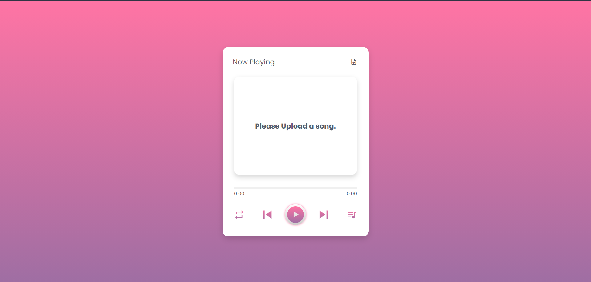
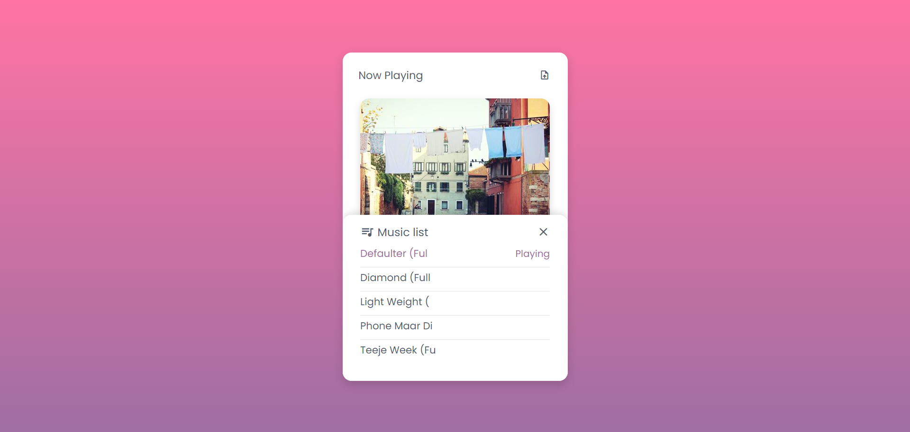

# Music Player

Music Player created using Vanilla Js and hosted using Turbo 360 environment. It can play audio files from your local device.

## Demo

https://music-player-oof0qi.turbo360-vertex.com
  
## Deployment

To deploy this project run

```bash
  npm install
```
```bash
  turbo devserver
```

  
## Features

- Listen local music
- Popup notifications
- Music queue system
- Simple UI

  
## Screenshots





  
## Support

For support, email adihgr18@gmail.com

  
